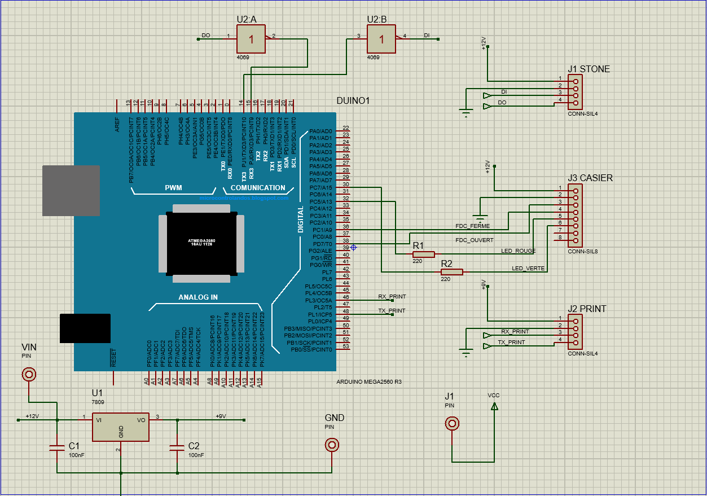

<div align="center">

<h3 align="center">B.R.A.S</h3>
<em>Projet BRAS - Code et Documentation.</em>

<br>


</div>

### Language de programmation


### Documentation


### Conception


### Marque Composants


### Marque Composant intégré

![img](https://img.shields.io/badge/Kerogs-fd4e2b.svg?style=for-the-badge&logo=data:image/svg+xml;base64,PHN2ZyBpZD0iY3JvY2hldCIgZGF0YS1uYW1lPSJrc2xsY3JvY2hldCIgeG1sbnM9Imh0dHA6Ly93d3cudzMub3JnLzIwMDAvc3ZnIg0KICAgIHZpZXdCb3g9IjAgMCAxMDAwIDEwMDAiPg0KICAgIDxkZWZzPg0KICAgICAgICA8c3R5bGU+LmNscy0xe2ZpbGw6bm9uZTt9DQogICAgICAgICAgICAuY2xzLTJ7ZmlsbDojZmZmZmZmO30NCiAgICAgICAgICAgIC5jbHMtM3tmaWxsOiNmZmZmZmY7fQ0KICAgICAgICA8L3N0eWxlPg0KICAgIDwvZGVmcz4NCiAgICA8dGl0bGU+S3NMYWJzIC0gQ29weXJpZ2h0IExvZ28gKGMpIGFsbCByaWdodCByZXNlcnZlcmQgdG8gS2Vyb2dzIExhYm9yYXRvcmllcy48L3RpdGxlPg0KICAgIDxwYXRoIGNsYXNzPSJjbHMtMSINCiAgICAgICAgZD0iTTAsMEgxMDAwVjEwMDBIMFpNNDAzLjUzLDczOC4zYTI5LjI5LDI5LjI5LDAsMCwwLDIuNDgsMy4zOHExMTguNDIsMTE4LjUsMjM2Ljg3LDIzN2E2LjgsNi44LDAsMCwwLDUuMzEsMi4yOGMxNi42Mi0uMSwzMy4yNC0uMDYsNDkuODYtLjA2aDMuMzZWNzk1LjEyYTI3LDI3LDAsMCwxLTMtMi4yNVE0NTIuMjMsNTQ2LjcyLDIwNiwzMDAuNThhNy4yNyw3LjI3LDAsMCwwLTQuNjQtMnEtODkuOC0uMTUtMTc5LjYzLS4wOGMtLjg1LDAtMS43MS4xMy0yLjYuMjEsMCwxNy42OC4wNSwzNS4xLS4wNiw1Mi41MWE3LjkxLDcuOTEsMCwwLDAsMi41OSw2LjIyUTE0Ni45Myw0ODIuNTgsMjcyLjEzLDYwNy44YTIyLjU2LDIyLjU2LDAsMCwwLDMsMi4xNkw2MSw5ODAuODdoMi41NXE5OC43LDAsMTk3LjM5LjA3YzIuMjIsMCwzLjE0LTEsNC4xMi0yLjY1cTE3LjY3LTMwLjc4LDM1LjQ1LTYxLjVjMTMuMDctMjIuNzEsMjYuMDUtNDUuNDcsMzkuMTYtNjguMTdRMzYzLDgwOC4yNiwzODYuNDMsNzY4QzM5Miw3NTguMzcsMzk3LjUsNzQ4Ljc2LDQwMy41Myw3MzguM1pNMjk5LjE4LDE5LjEzdjQuMTRxMCw4OS44Mi0uMDYsMTc5LjY1YTguMzUsOC4zNSwwLDAsMCwyLjY2LDYuNTNRNTE2LjA3LDQyMy41OSw3MzAuMjUsNjM3Ljg0YzIwLjIsMjAuMiw0MC40Nyw0MC4zNSw2MC41Miw2MC43YTkuMyw5LjMsMCwwLDAsNy41MSwzcTg5LjgyLS4xMiwxNzkuNjUsMGgzLjUxdi01NWE0MS4yOSw0MS4yOSwwLDAsMS00LjU5LTMuMzlRODUwLjg4LDUxNy4yNiw3MjUsMzkxLjI5Yy0uNzktLjgtMS41NS0xLjYyLTIuNDctMi41OFE4MjkuMSwyMDQsOTM1Ljc5LDE5LjIyYy0xLDAtMS41Ny0uMDktMi4xMS0uMDlxLTk4Ljg4LDAtMTk3Ljc1LS4wNUEzLjk0LDMuOTQsMCwwLDAsNzMyLDIxLjQycS0xNy42NywzMC44LTM1LjQ2LDYxLjUybC01OC44NywxMDJxLTE0Ljg4LDI1Ljc4LTI5Ljc3LDUxLjU2Yy00LjU3LDcuOTItOS4xNywxNS44My0xNC4wNiwyNC4yNy0xLTEuMjEtMS42My0yLjE3LTIuNDMtM3EtNTUuODktNTUuOTItMTExLjgtMTExLjgyUTQxNy4yOSw4My42MywzNTUsMjEuMzZjLTEtMS0yLjM2LTIuMTMtMy41Ny0yLjE0QzMzNC4xMSwxOS4wOCwzMTYuODIsMTkuMTMsMjk5LjE4LDE5LjEzWiIgLz4NCiAgICA8cGF0aCBjbGFzcz0iY2xzLTIiDQogICAgICAgIGQ9Ik00MDMuNTMsNzM4LjNjLTYsMTAuNDYtMTEuNTQsMjAuMDctMTcuMSwyOS42NnEtMjMuMzcsNDAuMzQtNDYuNzYsODAuNjZjLTEzLjExLDIyLjctMjYuMDksNDUuNDYtMzkuMTYsNjguMTdxLTE3LjcyLDMwLjc2LTM1LjQ1LDYxLjVjLTEsMS43LTEuOSwyLjY1LTQuMTIsMi42NXEtOTguNy0uMTItMTk3LjM5LS4wN0g2MUwyNzUuMTMsNjEwYTIyLjU2LDIyLjU2LDAsMCwxLTMtMi4xNlExNDYuODksNDgyLjYzLDIxLjY2LDM1Ny40NWE3LjkxLDcuOTEsMCwwLDEtMi41OS02LjIyYy4xMS0xNy40MS4wNi0zNC44My4wNi01Mi41MS44OS0uMDgsMS43NS0uMjEsMi42LS4yMXE4OS44MiwwLDE3OS42My4wOGE3LjI3LDcuMjcsMCwwLDEsNC42NCwyUTQ1Mi4yNyw1NDYuNjcsNjk4LjQ0LDc5Mi44N2EyNywyNywwLDAsMCwzLDIuMjVWOTgwLjg3aC0zLjM2Yy0xNi42MiwwLTMzLjI0LDAtNDkuODYuMDZhNi44LDYuOCwwLDAsMS01LjMxLTIuMjhRNTI0LjQ3LDg2MC4xNSw0MDYsNzQxLjY4QTI5LjI5LDI5LjI5LDAsMCwxLDQwMy41Myw3MzguM1oiIC8+DQogICAgPHBhdGggY2xhc3M9ImNscy0zIg0KICAgICAgICBkPSJNMjk5LjE4LDE5LjEzYzE3LjY0LDAsMzQuOTMtLjA1LDUyLjIxLjA5LDEuMjEsMCwyLjYsMS4xNywzLjU3LDIuMTRRNDE3LjMxLDgzLjYxLDQ3OS42LDE0NS45NHE1NS45LDU1LjkxLDExMS44LDExMS44MmMuOC44LDEuNDUsMS43NiwyLjQzLDMsNC44OS04LjQ0LDkuNDktMTYuMzUsMTQuMDYtMjQuMjdxMTQuOS0yNS43NywyOS43Ny01MS41Nmw1OC44Ny0xMDJRNzE0LjI4LDUyLjE5LDczMiwyMS40MmEzLjk0LDMuOTQsMCwwLDEsMy45NC0yLjM0cTk4Ljg4LjA5LDE5Ny43NS4wNWMuNTQsMCwxLjA5LDAsMi4xMS4wOVE4MjksMjA0LjIyLDcyMi40OCwzODguNzFjLjkyLDEsMS42OCwxLjc4LDIuNDcsMi41OHExMjUuOTQsMTI1Ljk0LDI1MS45LDI1MS44NmE0MS4yOSw0MS4yOSwwLDAsMCw0LjU5LDMuMzl2NTVoLTMuNTFxLTg5LjgyLDAtMTc5LjY1LDBhOS4zLDkuMywwLDAsMS03LjUxLTNjLTIwLTIwLjM1LTQwLjMyLTQwLjUtNjAuNTItNjAuN1E1MTYsNDIzLjYxLDMwMS43OCwyMDkuNDVhOC4zNSw4LjM1LDAsMCwxLTIuNjYtNi41M3EuMTItODkuODIuMDYtMTc5LjY1WiIgLz4NCjwvc3ZnPg==)


### Marque Equipement


### Hébergement
![img](https://img.shields.io/badge/KS--Infinite-4e42d4.svg?style=for-the-badge&logo=data:image/png;base64,iVBORw0KGgoAAAANSUhEUgAAAEAAAAA0CAYAAAA62j4JAAAFaUlEQVRogc2bCahWRRTHf+ZuoZVJUlZWlgiKJWpCJWJ7iBbZvmgokaglLShBCEVpJhEGSSJB5dIiGC1ie5hWlpTmizClVSQSwtKe2lP/cV7nyufX+5Y7c+/9/MP94N2Zc2bm3Jkz/zlzXjtJG0mPycCGALly3Ao8WKFsP7C3iuwh4CtgpuvpAXwCfONl9UFhGCWJyOd6SQcD2zdsl3SmpFll73+XtFjSyHr61ygDjJX0T+Tg+0maVqPeJkk3SGp3NBlgdOTgd0oaJGlKCpkvJQ1rqz/HZLCO0+Ai4C2gY6D8LmA0MBh4NoXcUOBzYE5520UaYBjwNtA1UP4v4EpgAPBCgLyNdRbwEdC79GURGASsAroHtrXXB38ysCSy3xcCnwHnFGWAfsC7wEmB8jb4MT5zXotYPqXoC3xqH6ZDBsqqoQ/wcemUS4kW4DrgALAa6JRh3+yDLM/TAL198KcGytvgxwN/+AwK9R2V8CNwTV4G6AW8B5wdKG9MboJ3ck2E76iEJuAKYEcePqCHe/uBgfIC7gCMon8IHF9SZg5wpE/fnsBw4DFgZwr95gAvtsH/11oYKhGhbpLWRpAcOcHp52yvFNOrkKsekp6pQ/cq72MuTLCTpPcD9SUwattH0k9l77fWyTLHSNpVQfdS72MuVLijpDcCdSWY5YPf1kbZyhRUe4CkX8vkF1Q6D2RhgPZu3RjMltRLUlMFHU0pzxu2hHa47Ow8T4Nm1UWRg58rqaekzTXqTUxphKGS7q5VL9YATwfKJ1jgDmx9HXVbJN1T7Wgb8sQY4PFA2QQLJXWRtCalnO0yIxptgFiHt8S/5LIIHaslXdIoA8RgqTvOsRnpM98xSVLXEAMUHRBZ5izvIHBGRjqNcS4GfnFWmOrsYdNQGXWkFqyd/sBWr3ecc/KsDJGgxaNFc4HfalUucga080hOe/97D3B7qhB2fbB4wb3ANuARoEtVqQb4gIfL1uGMnNvbIum8o8kJHpA0vKwj5bH9rNHs54T/GaBIH1AKm57n+zJIcK07sxNzajOJLr1Z+rLoXSCBxQmfKnu30j360pzaNN/wCjDkiLeFL4AjMa7C2rzAiU4e2FLKGRo1AxIsrhAwXe9h8BHACucNWeFcYEaiq1E+oBQW7b3aeUIl9PWtbbLzh1hYCO201hvoBi+BBNPqpK52cnxA0s8ZtGlUPJMlYN71RmBehI4n/cqrFv4E5nu0+U6PGofi8la5SCva/nqpf53Ofh0diq/bitnVeMyZzQtsb10sEWr2q+7STg6WtD9C5xOBx9qpAW1ZyCzYAG0NPnlmBuo0HIrIPfgiZVu7Y7bBu/zSoi3YGl0XqNcOTC+WXYbUiw9S1u9mP6EG2F6l7KCf+f8O1G3b08IAuQMp6++2n7yI0A/AfRHyNwG3pJQZUkedUljCRa5McJEnRYTCghqnA6cAZ9XQYVvaVSnb+d5+8s4PmORRn54BsnbJ+hJwGbAWaAZe9cvN7e4vjA/cDEzxv9PAcoYKyRIbH9hGAttVBkraF6mnHK2h9SIOQyv8WjsUj/pR9qEM+9SUzICiToPTa+wc1dDRYwTPeYZXFjgciyjKAJbfNzFCfoBHeSf4eSAGG923tKLIeIARlQUR8tM8YjQ1Qkezc5TDnKHogIhldm+JkH8eeMdDW2lxyLPKN5fKFW2AfcBtAawtQW+PIk1J6VNafPCvlxc0IiS2wT17KMZ5+tyEGlGkBHZlNgp4uc3SwD00Nl2+Q505AZWwx7NA5teoM0dS9zxuh7P4h4n+fqwOhRnw2DaCMN9Kul/SCfX0w6jwpoCpWHqhEQpzhhboDPXqnT2H2Na2LYfvPKnSLl3qA/AvAbrS2uRVStYAAAAASUVORK5CYII=)

## Installation
1. Effectuer la commande suivante pour cloner le repository
```sh
git clone https://github.com/kerogs/bras.git
```

## Accès à la documentation
Pour simplement ouvrir et consulter la documentation :
1. Rendez vous sur le site de la documentation [ks-infinite.fr](https://bras.ks-infinite.fr/)
   - Ou alors Passer à l'étape ***Modification et lancement de la documentation*** pour la version self hosted

## Modification et lancement de la documentation
Pour lancer la documentation en local et effectuer des modifications :

1. Installez ``NodeJS`` via [ce lien](https://nodejs.org/en/download/current)
2. Clone le repository
```sh
git clone https://github.com/kerogs/bras.git
```

2. Accédez au dossier ``/docs/``
```sh
cd docs
```

3. Installer les packages
```sh
npm install
```

4. Exécutez la commande suivante pour lancer la documentation en local :
```sh
npm run docs:dev
```


Une fois le chargement terminé, une adresse IP locale avec son port sera affichée. Ouvrez cette adresse dans un navigateur web pour accéder à la documentation.

Tous les fichiers de documentation sont rédigés au format Markdown, mais fonctionnent sous VitePress. Vous pouvez donc vous renseigner sur la personnalisation de VitePress.

## Code arduino
Tout le code Arduino est situé dans le dossier  ``/public/code/``. Le code principal se trouve dans ``/public/code/main.ino``. Il existe une partie qui s'appelle ``admin.ino`` qui sert à tester l'intégralité du code. La documentation des commandes est disponible dans la section ADR dans la version du code admin choisis. 

### Modifications
***Voici la liste des éléments à ajouter :***

- Intégrer votre nouvelle version de code dans le dossier ADR et la lier à son fichier ``/docs/ADR/index.md``.
- Toute ajout de fonction, variable ou dépendance.

Avant d'apporter des modifications, veuillez mettre à jour la documentation. Si vous souhaitez générer la documentation au format HTML et la placer dans ``/public/docs/`` exécutez la commande suivante :

```bash
npm run docs:build
```

Si vous modifiez la sortie de la documentation, pensez également à modifier le chemin d'accès dans le fichier ``/docs/.vitepress/config.mts``
```ts
export default {
  outDir: '../public/docs'
}
```

Si vous modifiez la sortie de la documentation, pensez également à modifier le chemin d'accès dans le fichier ``/docs/.vitepress/config.mts``
```ts
export default {
  base: '/public/docs/',
}
```

## Utilisation de la documentation.
Le code embarque avec lui une version selfhosted de la documentation. Pour cela, il vous suffit d'effectuer les commandes suivantes :
- Accédez au dossier ``/docs/``
```sh
cd docs
```

- Exécutez la commande suivante pour build la documentation :
```sh
npm run docs:build
```
- Ou le faire en 1 commande
```sh
cd .\docs\; npm run docs:build
```
- Il vous suffit donc maintenant d'héberger en local les fichiers HTML (important pour le chargement du CSS)


## Schéma + Shield



## License
Licence Apache 2.0 (voir le fichier LICENSE)

## Autheurs
- [Kerogs](https://github.com/kerogs) [Lucas W.]
- Florian V.
- Jessy K.

[](https://opensource.org/licenses/Apache-2.0)